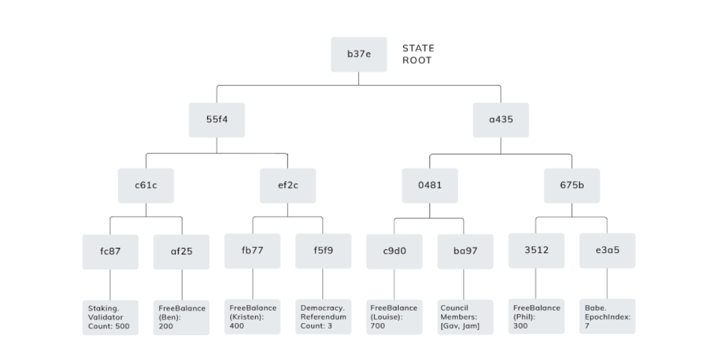
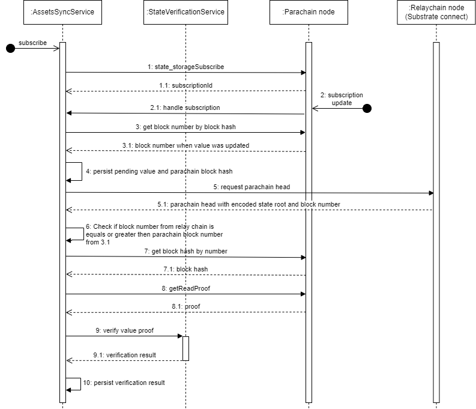

# Introduction

This document describes the process of the data verification that application gets from the parachain 
using RPC node connection.

# The business case

When the application gets the data from the parachain it connects to the parachain node. 
The node may be malicious and send the wrong data to the application (wrong balance for example).
As a user I'd like to know if data is verified or not.

Prerequisites:
1. Application uses the [substrate-connect](https://substrate.io/substrate-connect/) technology for interacting with the relay chain to which parachain is connected.
2. Application trusts to the data that was retrieved using the substrate-connect technology

Valid scenario:
1. Application gets the data from the parachain
2. Application validates the data from the parachain using the relay chain data

## Input data

When the verification process starts it has the following data:
1. The number of parachain block

## Output data

The result of the verification is:
1. ```True``` or ```False```. ```True``` if data is valid, else ```False```

# Parachain data verification approach
Parachain State trie verification should be used for parachain data verification. A parachain’s state is stored in a Merkle trie. Every data point in the state consists of a key and a value<sup>1</sup>.
The state root is a root element of the state trie. State root stored for the every parachain block:

The parachain RPC call `chain_getHeader(block_hash)` returns the `stateRoot`:
```json
{
  parentHash: 0xf3ceee622e957a06509977cf3fec40ed1a7614c017db6768edc1b195ebb9e026
  number: 1,722,016
  stateRoot: 0xac1456a15380b6507cc4b269b1bcb034e3890ce92f449fbdc5b51dc0d16c60f5
  extrinsicsRoot: 0xbad2914e0e819be60af149a1d022effefa6e22f74998522db4bfeb7b9b330181
  digest: {
    logs: [
      {
        PreRuntime: [
          nmbs
          0xd2d586726e13305752b4b2b85c4faba209b65d6030662b0de1ca8745e9feaa11
        ]
      }
      {
        Consensus: [
          fron
          0x012db791c6a84b4c3de1a5487ed0414dcc26ba9ee4e6115a1f3bc2ed0c3c59436660ac1a879911881388bf30777017add443e3d9718cb4d8dd7d42d5d7c51f49a2283f8c44c2239e3d982cc07448b582ff8678c4357886eb897f2e2eeb4e4af3e4bdc8ffe3cd9e958aa2ef0aaf619dfcd7b2cd47b891358c49cfc0affa254f50f04b98655b4ccf5de9bf256e2a803ad0ce8dff3cc4c3a63cee34924d7ce5d815b0abf61a3bffa86a343fd8f87e40dcce97badbf33773fea86efb624ca17e635f8e1dd6ba4a801f8112e94be963bdbdc19a0a9a2ea5cfd8953ab7b495e27b22a5f788dc434b7de0e6dd435a1ead920b7680e4eba5a26b1080e10c7513e2423a33b4e081c0e6079584b8dcfad3f11116a4a6e7a25e1b91b280750c6e2220f069905c377dcb06ca01204b9ac3f35d0f2a87e13264a6f6d1efd2fa40e8438c666017d1e748c5364ab44904894823b84f0ff94f2fcf7559f399cbe19308b8026d3b7f0351474dedadcbd383dc7e2acd5798ea4bb7afb7f284adaeb496b257a642778566ad6ff6d7651b0096b588222220fe77c70da5b2378fea2b48bba117292a59332d9a7e2881ac8b0f3cbf24a347fc1d5f8d4112ed166f196926b5c519711deca321b35b96ccad51a9078531c3c750d85650e9f3c80f5eb0adb3c6192b1b2b6606e263f8ce9c4b1b922f84ac11ad6f3b7e88eac44e9302f0dab84516f2817fd0b7973f96a2563587265cf3494454f3d84d56d44bb0fa118f1597b6d9dbf523cbc4394f8c508e12aa80eabf741dc941d19d754f74b00ac691da3ad178c114716258b2def3715e59cd1e733e7d132192b57fc28a40e37c5df464f7b5ac2f626197aeea45e9c9af831bb252624fe1c86f9824331f607a5e3cd50d50f32d679e12148c1b44be6a56b57e23701249b1b4bafe9aa52dfd55d4297902bac111669d9a51c8faf079ba6eaf451c8c1ded68e4a2bf7680caeb6309390930ce9a3b371662480d163ddb208659a29e8bdeff37643f033f8b2293ce38b85d6a5bf8a5323017db2300d4394bc50171f26240b35aa16aa8e6cbefdb8482c072879f1d9c68fc08ff1c67c7eb291eb8f4dcdc6660619f209422d12a35c6fd569d2057f1722172964e2d6acc
        ]
      }
      {
        Seal: [
          nmbs
          0x56621d25f60b41a2c886604f59215427af385a3ddbe09eede6b0de5d55ce5461f81de86fbfe3b2178c6c0d1412fdb9ca169fe6df838323d99ca2b29f5a160c89
        ]
      }
    ]
  }
}
```

When the parachain block is accepted by the relay chain the storage then relay chain storage map `Heads: map ParaId => Option<HeadData>`
is updated. This storage map contains the head-data of every registered parachain<sup>3</sup>.
The storage call `paras_heads(parachainId)` returns encoded header. For example the Moonriver `parachainId = 2023` returns
```text
0x4cff0970f694bf3f360f178f3bb4770446f619437c7069646ffeb0b1d971224a3e1b69004a1f98da49b93c1ab07a8b3f19aa819cf886418b5eed18ee8a468098836988a67938e66bff39f81d60d297380a388e94631d50a1b0e2aee945b134e60ffd97ca0c066e6d627380c477853bc58f77aad0bff8dabe6a5810c098f59b0442c6946cb26aab810a13520466726f6e090501461841b8cab2ecdb3d4fa71550fecc2f81a9173cb0f98e36dea9aa83560651ad24d1f7c25ccdb6ce6e395da80c80b25929b4990822993ecf0b0e2717e77958a24f3b562dce9c16a8a60389daa79608948bae25de2ea2682332dc3119c84868f3155a9158d46f87cf4e393cbcaa45362c23febff8b33ab207f4280c9571416d667643730307cd24d0fdbc3a40e416aaea8fb2544fcdc33ad14b32d2b409f2b34f307c7bef1d9a85f7dba3edc79f4d4283fdfc85c63c444e20834eceb6d7e9dee7e8abc178c31033ab57c869c99ae07d96a7f0144732c9399de9dbc27a97c9bb8fdf42a52004123af4213baa91c59bfd692b136c690505d26f2c84f33fad5d3994fbe7bab9a035676e253c0c22aee92ae2a2f012ea925634c25ab556fac5398f908b91a11b383af28f972044491d6ee63739a6c5fc6e07d19a57ef1f99f70a187642056e6d6273010150314bf1ab5c40080b987402aedfa75677869a5f28f0d3fd91e45efaa302f829f5d247040b4657975fad374c53cb33e547e12b8449accf3fa09992e61c1c0285
```
The header is a part of a storage of `Paras` module:

```
/// The head-data of every registered para.
Heads: map ParaId => Option<HeadData>;
```
Head data is a type-safe abstraction around bytes (Vec<u8>) for the purposes of representing heads of parachains or parathreads<sup>3</sup>.
```
struct HeadData(Vec<u8>);
```
More about `HeadData` may be found in the [parachain implementation guide](https://w3f.github.io/parachain-implementers-guide/types/index.html).
It's a parachain block's header data, it may be decoded using parachain types definition.

As a result it's possible to verify the data that application. The sequence of relay chain and parachain interaction
described on the sequence diagram below.


1. Application subscribes to the storage in order to get the data (`pending value`) for the application
2. and 2.1 Application gets the data (`pending value`) from the subscription and `block hash`. The `block hash`
is a hash of block where the `pending value` was changed. It's needed for further verification.
3. Application gets the `block number` by the `block hash` from the item 2.
4. Persist the `pending value`, `block hash` from 2.1 and `block number` from 3. The `pending value` is pending because it 
should be verified.
5. Request parachain head (HeadData) from the relay chain using substrate connect and decode it in order to get 
the parachain `state root` and `block number`
6. The application should check if it validates the state **after** the value change. 
If `block number` from 5 is greater or equals to `block number` from 3.1 then proceed to 7 else repeat 5. 
7. Get the `block hash` from the parachain by the parachain `block number` from 5.
8. Get the `read proofs` array from the parachain by the `block hash` from 7.
9. Build the state root from `read proofs` from 8 and get `calculated state root`. 
Compare the `calculated state root` from 9 with the `state root` from 5:
    1. If `calculated state root == state root` then `pending value` is valid
    2. Else `calculated state root != state root` then `pending value` is not valid or outdated. Start from 1.

# Example

For example for the Moonriver parachain (`paraId = 2023`) the `head` information may be retrieved using the storage query on the Kusama relay chain:

```typescript
  const kusamaWsProvider = new WsProvider('wss://kusama-rpc.polkadot.io');
  const kusamaApi = await ApiPromise.create({ provider: kusamaWsProvider });
  const heads = await kusamaApi.query.paras.heads(2023);
```

The `head` should be decoded using the Moonriver specific types

```typescript
 const moonriverWsProvider = new WsProvider(
    'wss://wss.api.moonriver.moonbeam.network'
  );
  const moonriverApi = await ApiPromise.create({
    provider: moonriverWsProvider
  });
  const decodedHeads: Header = moonriverApi.registry.createType('Header', heads.toString());
  const decodedHeadsJson = decodedHeads.toJSON();
```

The storage `proofs` may be retrieved using the RPC `state_getReadProof`

```typescript
 const readProofs: ReadProof = await moonriverApi.rpc.state.getReadProof(
    [accountStorageKey],
    parachainBlockHash.toString()
  );
```

The `state_root` should match the Merkle trie root calculated based on the `readProofs`.

# Links
1. [The Path of a Parachain Block](https://polkadot.network/blog/the-path-of-a-parachain-block/)
2. [The Path of a Parachain Block (Video)](https://www.crowdcast.io/e/polkadot-path-of-a-parachain-block?utm_source=profile&utm_medium=profile_web&utm_campaign=profile)
3. [Paras Module](https://w3f.github.io/parachain-implementers-guide/runtime/paras.html)
4. [Parachain implementation guide](https://w3f.github.io/parachain-implementers-guide/types/index.html)
